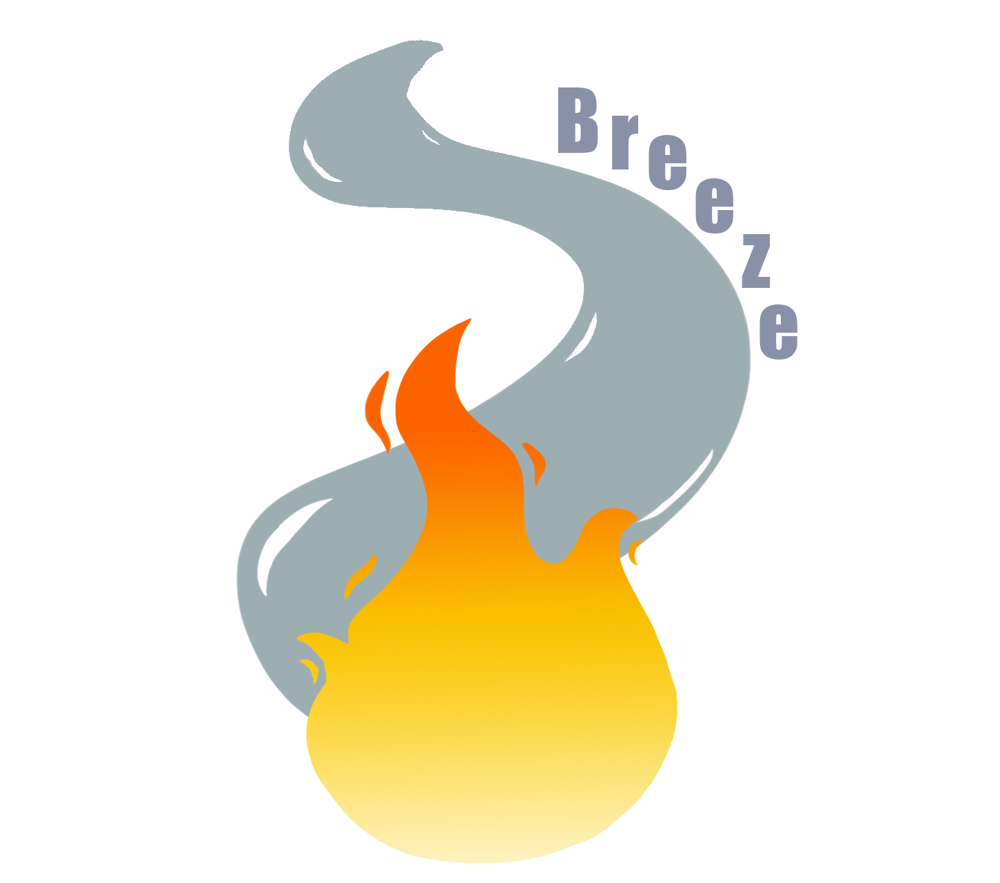

# Hello, we are team Breeze! 

# Contributors 🐱‍💻

- Maksimiliyan Dimov 9 A *<MKDimov19@codingburgas.bg>* - Scrum Trainer

- Ivaylo Radev 9 G *<IMRadev19@codingburgas.bg>* - Designer

- Maria Ilcheva 9 V *<MZIlcheva19@codingburgas.bg>* - Front End Developer

- Mirena Dzhebarova 9 B *<MSDzhebarova19@codingburgas.bg>* - Back End Developer

# Features 🧯

Hi! We are team **Breeze**. The task we had to complete for this project was to create a website using *HTML5 & CSS3 & JavaScript*. The topic is **"Fire Department"**. We decided to make the website of the *Fire Department*. Its purpose is to help people take care of fires and an easier way to call an Emergency is provided in the site. The user can see how many *units* are available and the most recent **news** associated with fires. There is also a **map** where the user can see where the *Fire Department* is located. There are **tips** on how to put down a fire in different *occasions*.

# Links 🧬

* [Presentation](https://codingburgas-my.sharepoint.com/:p:/g/personal/msdzhebarova19_codingburgas_bg/EdnGwyF7n55Km2wc6zkVx4cBSWXPHHQAcqZ6-CDGCG86EQ?e=pLTD6C)
* [Documentation](https://codingburgas-my.sharepoint.com/:w:/g/personal/msdzhebarova19_codingburgas_bg/EVnd8UjHVKVJvSC3xQ7WWEABYQHyWy7UEqoqDi_EG2cCzA?e=ChgsrH)